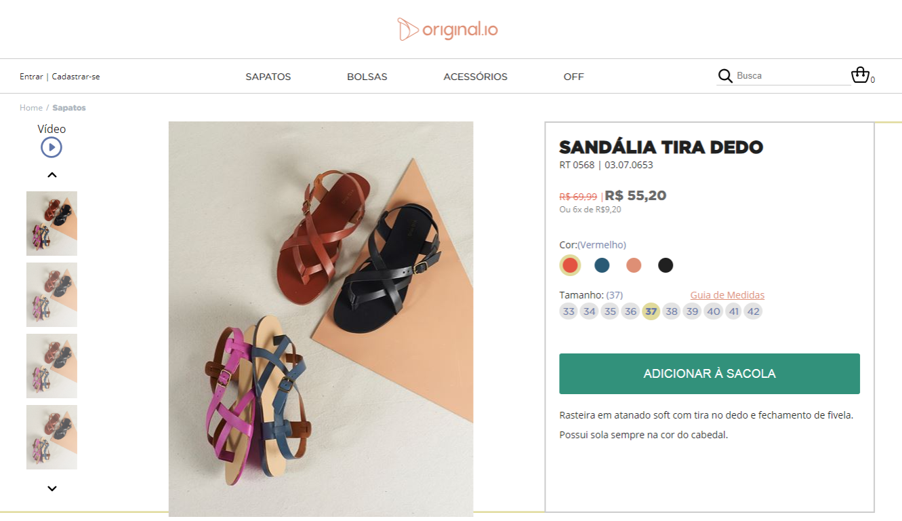

### Shoes Store - Challenge for Original.io

## Check it out!
https://andreaweb.github.io/shoes-store/

Project created when going for a Senior or Mid Level Front-End Developer Position at Original.io. Consists of a single page that simulates a shoes and accessories store. Clicking on the shopping button updates the shopping bag. Clicking on a suggested product changes active product. Clicking on a thumbnail or thumbnail arrow changes active thumbnail (there's only one main picture, so it stays the same). Other than that most of the links are just decorative and will not work.

This project uses React and media queries with CSS Flex to assure it is responsive.

### Instructions

1. Download/clone the project.

2. Install the dependencies with `npm install`.

3. Run the project with `npm start`.